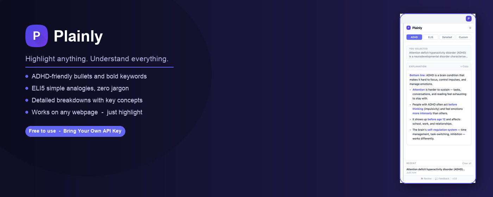
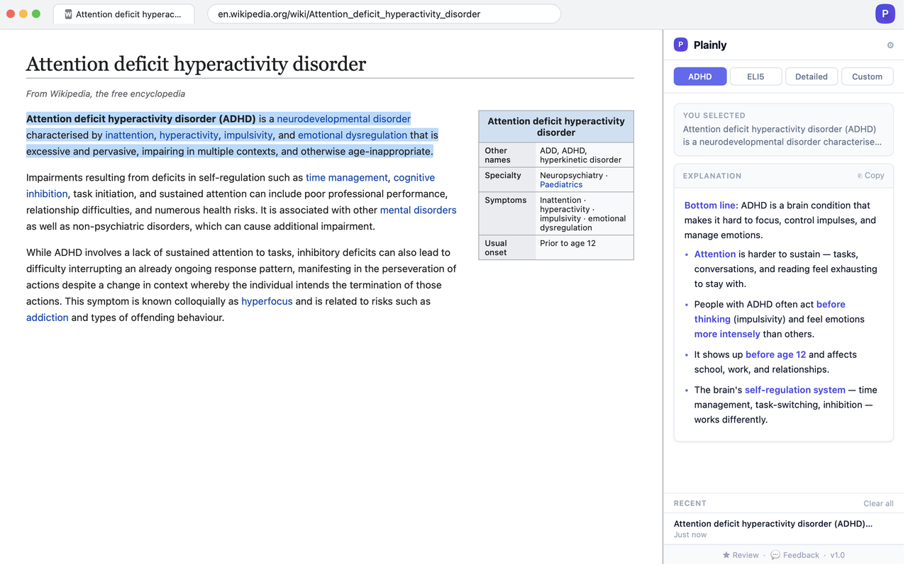
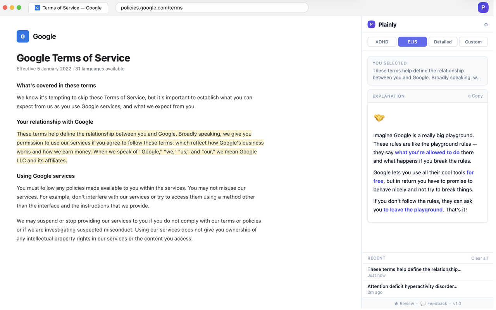
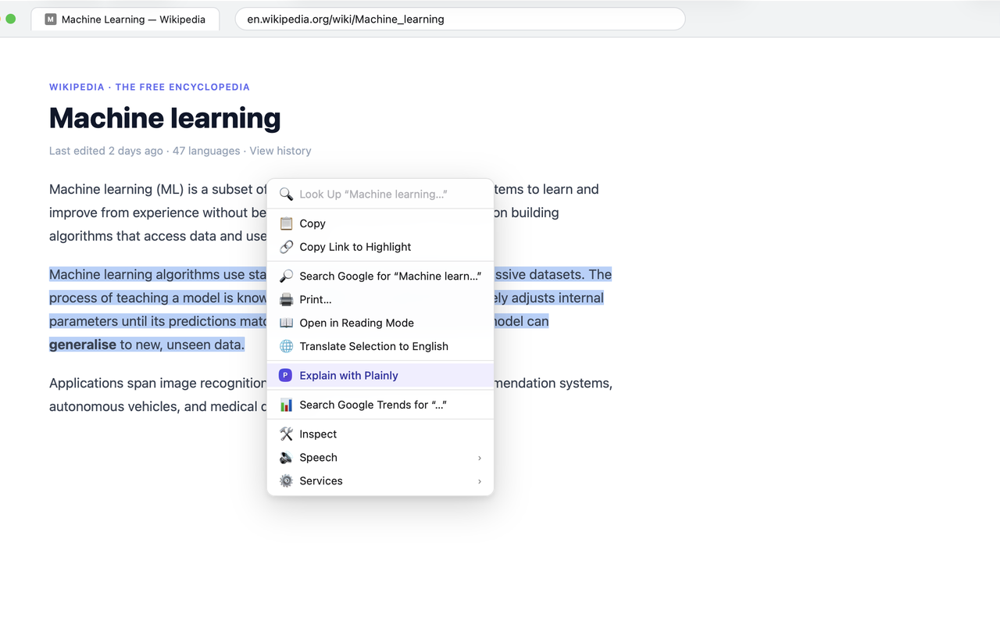
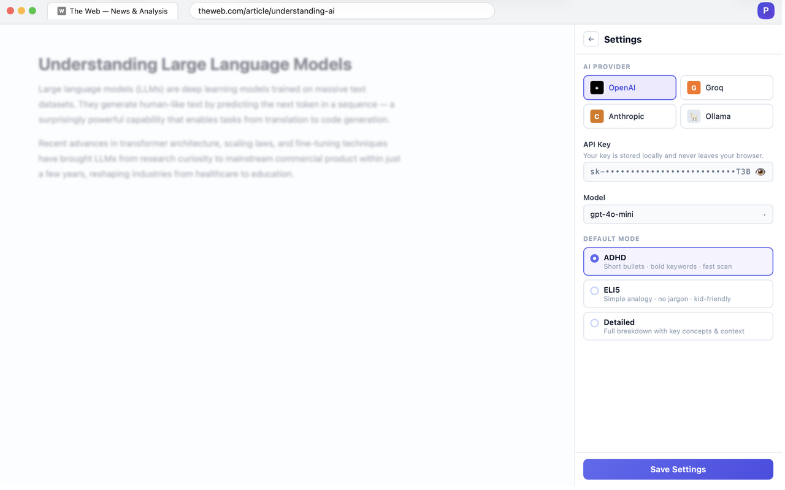

<div align="center">


# Plainly

### Highlight anything. Understand everything.

A Chrome extension that instantly explains any text you highlight — in ADHD-friendly bullets, plain English (ELI5), detailed breakdowns, or your own custom prompt. Uses your own AI API key, runs entirely in your browser.

[](https://chromewebstore.google.com/detail/plainly/ekkeccmiolilkkaeehehoicddecmcanp)
[](LICENSE)
[](PRIVACY.md)

---



</div>

---

## ✨ Features

| Mode | What it does |
|---|---|
| **ADHD-friendly** | Short bullets, bold key terms, under 150 words — fast to scan |
| **ELI5** | Simple analogies, no jargon, 2–4 sentences |
| **Detailed** | Structured breakdown with key concepts and context |
| **Custom** | Write your own system prompt — explain like a lawyer, summarise in one line, anything |

- **Highlight to explain** — select text on any webpage and the explanation appears instantly in the side panel
- **Right-click menu** — "Explain with Plainly" in Chrome's context menu as an alternative trigger
- **History** — last 20 explanations saved locally, each remembering its mode
- **Enable / disable toggle** — pause Plainly with one click without uninstalling
- **Multiple AI providers** — OpenAI, Groq (free tier), or any OpenAI-compatible endpoint (Ollama, n8n, etc.)
- **BYOK** — Bring Your Own Key. No Plainly server. No subscription.

---

## 📸 Screenshots

<table>
  <tr>
    <td></td>
    <td></td>
  </tr>
  <tr>
    <td align="center"><em>ADHD mode — Wikipedia article</em></td>
    <td align="center"><em>ELI5 mode — Terms of Service</em></td>
  </tr>
  <tr>
    <td></td>
    <td></td>
  </tr>
  <tr>
    <td align="center"><em>Right-click context menu trigger</em></td>
    <td align="center"><em>Inline settings — provider, model, mode</em></td>
  </tr>
</table>

---

## 🚀 Getting Started

### Option 1 — Chrome Web Store (recommended)

> Install directly from the [Chrome Web Store →](https://chromewebstore.google.com/detail/plainly/ekkeccmiolilkkaeehehoicddecmcanp)

### Option 2 — Load unpacked (developer)

```bash
git clone https://github.com/coder-RT/plainly.git
cd plainly
```

1. Open Chrome → `chrome://extensions`
2. Enable **Developer mode** (top right)
3. Click **Load unpacked** → select the `plainly/` folder
4. Click the Plainly icon in the toolbar to open the side panel
5. Go to **Settings** → add your API key

---

## 🔑 API Key Setup

Plainly works with any of these providers:

| Provider | Model | Cost | Get key |
|---|---|---|---|
| **OpenAI** | gpt-4o-mini (recommended) | ~$0.001 per explanation | [platform.openai.com/api-keys](https://platform.openai.com/api-keys) |
| **Groq** | Llama 3.3 70B | Free tier available | [console.groq.com/keys](https://console.groq.com/keys) |
| **Ollama** | Any local model | Free (runs locally) | [ollama.com](https://ollama.com) |
| **Custom** | Any OpenAI-compatible API | — | Your endpoint URL |

> Your API key is stored locally in your browser using `chrome.storage.sync`. It is never sent to any Plainly server.

---

## 🏗 Project Structure

```
plainly/
├── manifest.json          # Extension manifest (MV3)
├── background.js          # Service worker — API calls, message routing
├── content.js             # Content script — text selection detection
├── sidepanel.html/css/js  # Side panel UI
├── options.html/css/js    # Options page (legacy)
├── prompts/
│   ├── adhd.js            # ADHD-friendly system prompt
│   ├── eli5.js            # ELI5 system prompt
│   ├── detailed.js        # Detailed system prompt
│   └── index.js           # Re-exports all prompts
├── icons/                 # Extension icons
└── screenshots/           # Store screenshots and mockups
```

---

## 🔒 Privacy

**Plainly collects zero data.** No analytics, no telemetry, no backend server.

- Your API key stays in your browser (`chrome.storage.sync`)
- Selected text is sent **directly** from your browser to your chosen AI provider, using **your own API key**
- Explanation history is stored **locally** in your browser only

Read the full [Privacy Policy →](PRIVACY.md)

---

## 🛠 Development

```bash
# Install dev dependencies (icon generation script only)
npm install

# Regenerate icons from source
node scripts/generate-icons.js
```

To edit prompts, modify the files in `prompts/` — each mode is a separate file so you can tweak, add, or remove modes independently.

---

## 📋 Roadmap

- [ ] Phase 2 — Proxy backend for users who don't want to manage API keys
- [ ] Keyboard shortcut to trigger explanation
- [ ] Export history to Markdown / Notion
- [ ] Per-site prompt preferences
- [ ] Firefox support

---

## 🤝 Contributing

Issues and PRs are welcome. Please open an issue first to discuss what you'd like to change.

---

## 📄 License

MIT © [Plainly](https://github.com/coder-RT/plainly)
